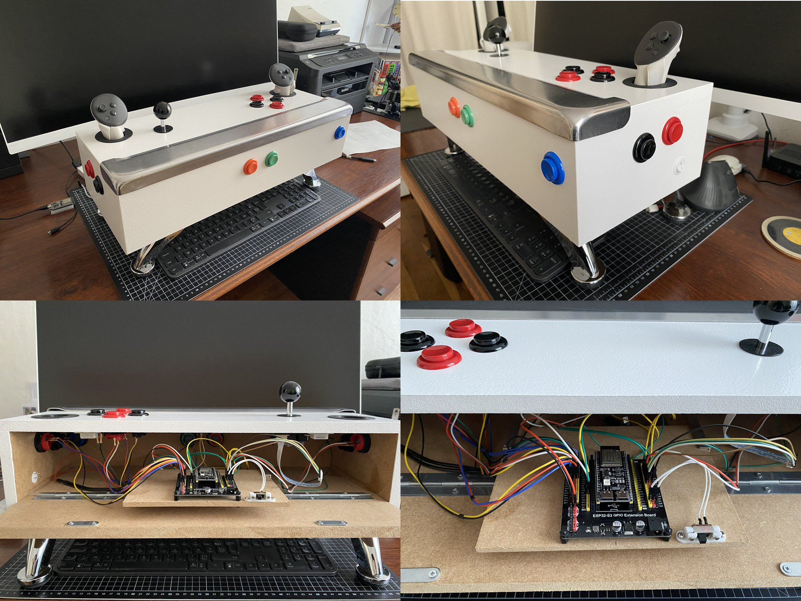

# ESP32 VR Pinball Controller

A Bluetooth Low Energy (BLE) HID controller for VR pinball on Quest, using an ESP32 microcontroller and an MPU6050 accelerometer.  
This controller supports two runtime modes to work with different VR pinball games:

- BLE keyboard mode: **Pinball FX VR**
- BLE gamepad mode: **Pinball VR Classic**

Successfully tested on Quest 3 and should work with PCVR pinball games with minor adjustments.

Happy playing! :smile:

> ## Table of Contents
>
> - [Features](#features)
> - [Hardware Requirements](#hardware-requirements)
> - [Installation](#installation-with-arduino-ide)
> - [Usage](#usage)
> - [Troubleshooting](#troubleshooting)
> - [License](#license)

## Features

- BLE HID communication using the [SQUIDHID](https://github.com/gargum/SQUIDHID) library (great lib, thanks @gargum)
- Debounced button handling with `INPUT_PULLUP` wiring (pressed state = `LOW`)
- Runtime mode switching via long press of **`Select` + `Start`** buttons
- MPU6050 motion interrupt-based nudge detection with direction analysis
- Configurable button mappings for both keyboard and gamepad modes
- Optional RGB LED status indicator (when `RGB_BUILTIN` is available)

## Hardware Requirements

The lockbar is a genuine original Bally. :star_struck:

### Main Components

- **ESP32-S3** development board (other ESP32 variants should work too, provided they have BLE and enough GPIO pins)
- **MPU6050** 6-axis accelerometer/gyroscope module (I²C interface)
- **11 momentary push buttons**, (actually less are required for FX & Classic, but this is for future proofing and custom mapping support with PCVR games)
  > [!TIP]
  > GoldLeaf Pushbuttons from Ultimarc are great for this purpose.
- **Arcade joystick** for D-pad input (optional, can be replaced with 4 buttons, only required for VR Classic to navigate menus)
- 5v power supply (I use a 5V power bank)

### Wiring

#### I²C Connection (MPU6050)

> [!IMPORTANT]
> The current code is designed with inverted X and Y axes (rotated 90° to the left).  
> The module must be oriented with the components facing up and the connectors on the
> player's side (VCC pin on the left and interrupt pin on the right).

| MPU6050 Pin | ESP32   | Description          |
|-------------|---------|----------------------|
| VCC         | 3.3V    | Power supply         |
| GND         | GND     | Ground               |
| SDA         | GPIO 8  | I²C data line        |
| SCL         | GPIO 9  | I²C clock line       |
| INT         | GPIO 10 | Motion interrupt pin |

#### Button Connections

All buttons use `INPUT_PULLUP` mode.   
Connect one side to the specified GPIO and the other side to GND.

| Function       | GPIO | Description          |
|----------------|------|----------------------|
| Select         | 1    | Select button        |
| Start          | 2    | Start button         |
| Launch         | 4    | Ball launch button   |
| A              | 5    | Action button A      |
| B              | 6    | Action button B      |
| X              | 7    | Action button X      |
| Y              | 15   | Action button Y      |
| L1             | 42   | Left flipper         |
| L2             | 41   | Left "magna save"    |
| R1             | 16   | Right flipper        |
| R2             | 17   | Right "magna save"   |
| Joystick Left  | 37   | D-pad/joystick left  |
| Joystick Right | 38   | D-pad/joystick right |
| Joystick Up    | 39   | D-pad/joystick up    |
| Joystick Down  | 40   | D-pad/joystick down  |

## Installation with Arduino IDE

### Board

#### ESP32 3.3.6 *by Espressif Systems*

- See https://docs.espressif.com/projects/arduino-esp32/en/latest/installing.html#board-manager-settings
  > [!CAUTION]
  > At the time of writing, the `3.3.7` version seems incompatible with the BLE library.

### Libraries

- Go to "Tools" -> "Manage Libraries".

#### NimBLE-Arduino 2.3.7 *by h2zero*

- Click "Filter your search" and type "NimBLE-Arduino".
- Select version `2.3.7` and click the "Install" button.

#### MPU6050 library 1.4.4 *by Electronic Cats*

- Click "Filter your search" and type "MPU6050 cats".
- Select version `1.4.4` and click the "Install" button.

#### SquidHID library *by gargum*

- In you browser, go to https://github.com/gargum/SQUIDHID
- Download the .ZIP file of this repo.
- In the Arduino IDE go to "Sketch" -> "Include Library" -> "Add .ZIP Library..." and select the file you just downloaded.

## Usage

### Initial Setup

1. Power on the ESP32
2. Wait for the device to complete MPU6050 calibration (keep it still)
3. On your VR headset or PC, pair with the BLE device named "VR Pinball controller"

### Mode Switching

Hold **Select + Start** simultaneously for 2 seconds to toggle between modes:

- FX Mode (keyboard): RGB LED = Blue (like in key**B**oard)
- Classic Mode (gamepad): RGB LED = Green (like in **G**amepad)

A 6 seconds cooldown prevents accidental mode switching.

### Nudge Detection

1. The MPU6050 detects table nudges via motion interrupt:
1. Motion exceeds threshold → interrupt triggered
1. Controller samples accelerometer 10 times
1. Dominant axis determines nudge direction (up/down/left/right)
1. **FX Mode:** Sends corresponding keyboard key
1. **Classic Mode:** Deflects left analog stick to full scale
1. After 100ms, input returns to neutral

## Troubleshooting

### Serial Monitor Output

- Connect at **115200 baud** to see debug information

> [!TIP]
> Use a serial monitor like [Termite](https://www.compuphase.com/software_termite.htm)

### Compilation Errors

- Verify all required libraries are installed
- Check libraries versions

### Device Not Connecting

- Verify that Bluetooth is enabled on your host device (Quest or PC)
- Check that device "VR Pinball controller" appears in Bluetooth settings
- Remove previously paired and restart host device
- Restart ESP32 and retry pairing

### MPU6050 Not Detected

- Verify I²C wiring (SDA, SCL, VCC, GND)
- Check MPU6050 address (default 0x68, some boards use 0x69)
- Update MPU6050_ADDR constant if needed

### Nudge Not Working Correctly

- Ensure MPU_INT_PIN wiring is correct
- Verify MPU6050 orientation matches documentation
- Adjust MOTION_DETECTION_THRESHOLD in code if too sensitive or insensitive

## License

MIT License

Copyright (c) 2026 CosmicMac

Permission is hereby granted, free of charge, to any person obtaining a copy
of this software and associated documentation files (the "Software"), to deal
in the Software without restriction, including without limitation the rights
to use, copy, modify, merge, publish, distribute, sublicense, and/or sell
copies of the Software, and to permit persons to whom the Software is
furnished to do so, subject to the following conditions:

The above copyright notice and this permission notice shall be included in all
copies or substantial portions of the Software.

THE SOFTWARE IS PROVIDED "AS IS", WITHOUT WARRANTY OF ANY KIND, EXPRESS OR
IMPLIED, INCLUDING BUT NOT LIMITED TO THE WARRANTIES OF MERCHANTABILITY,
FITNESS FOR A PARTICULAR PURPOSE AND NONINFRINGEMENT. IN NO EVENT SHALL THE
AUTHORS OR COPYRIGHT HOLDERS BE LIABLE FOR ANY CLAIM, DAMAGES OR OTHER
LIABILITY, WHETHER IN AN ACTION OF CONTRACT, TORT OR OTHERWISE, ARISING FROM,
OUT OF OR IN CONNECTION WITH THE SOFTWARE OR THE USE OR OTHER DEALINGS IN THE
SOFTWARE.
