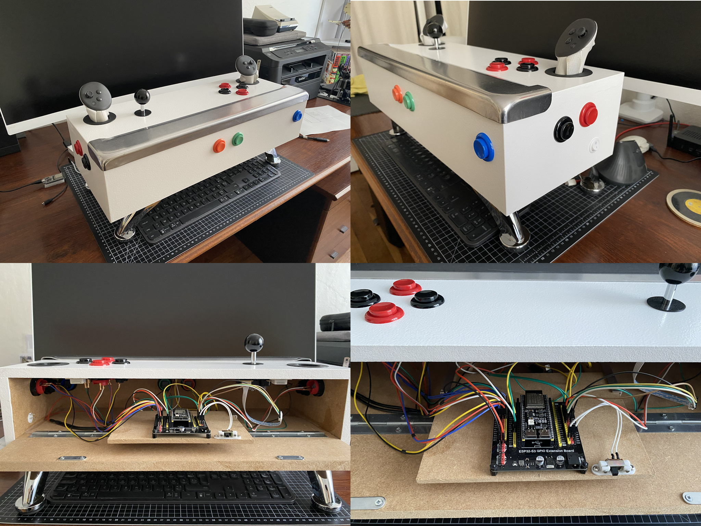

# ESP32 VR Pinball Controller

A Bluetooth Low Energy (BLE) composite HID controller for VR pinball, with MPU6050 sensor for realistic nudging.

Literally a game changer! :star_struck:

Keyboard or gamepad mode for compatibility across different games:

- Pinball FX VR (Meta Quest)
- Pinball VR Classic (Meta Quest)
- Visual Pinball X (PC)

Easily adaptable to other games (as long as they support keyboard or gamepad input).

## Table of Contents

- [Features](#features)
- [Hardware Requirements](#hardware-requirements)
- [Installation](#installation-with-arduino-ide)
- [Usage](#usage)
- [Troubleshooting](#troubleshooting)
- [Change Log](#change-log)
- [License](#license)

## Features

- Composite BLE HID communication (keyboard + gamepad), now without relying on an external HID library
- 11 buttons (Select, Start, Launch, A, B, X, Y, Left flipper, Left magnasave, Right flipper, Right magnasave)
- 4 D-pad input (to navigate in Pinball VR Classic menu)
- 1 dedicated button for mode cycling (FX, Classic, VPX)
- Nudge detection with direction analysis (MPU6050)
- Optional RGB LED status indicator (when `RGB_BUILTIN` is available)

## Hardware Requirements

### Main Components

- **ESP32-S3** development board (other ESP32 variants with BLE should work too, provided they have enough GPIO pins)
- **MPU6050** 6-axis accelerometer/gyroscope module (I²C interface)
- **11 momentary push buttons** (fewer are required if you intend to use only FX & Classic)

> [!TIP]
> GoldLeaf Pushbuttons from Ultimarc are great for this purpose.

- **Arcade joystick** for D-pad input (optional, can be replaced with 4 buttons, only required for Classic to navigate menus)
- 1 additional momentary push button for mode cycling (FX, Classic, VPX)
- 5V power supply (I use a 5V power bank)

### Wiring

#### I²C Connection (MPU6050)

> [!IMPORTANT]
> The current code is designed with inverted X and Y axes (rotated 90° to the left).  
> The module must be oriented with the components facing up and the connectors on the
> player's side (VCC pin on the left and interrupt pin on the right).

| MPU6050 pin | ESP32 pin | Description          |
|-------------|-----------|----------------------|
| VCC         | 3.3V      | Power supply         |
| GND         | GND       | Ground               |
| SDA         | GPIO 8    | I²C data line        |
| SCL         | GPIO 9    | I²C clock line       |
| INT         | GPIO 10   | Motion interrupt pin |

#### Button Connections

> [!IMPORTANT]
> Connect one leg of each button to the specified GPIO pin and the other leg to GND.

| Button          | GPIO pin |
|-----------------|----------|
| Select          | 1        |
| Start           | 2        |
| Launch          | 4        |
| Action A        | 5        |
| Action B        | 6        |
| Action X        | 7        |
| Action Y        | 15       |
| Left flipper    | 42       |
| Left magnasave  | 41       |
| Right flipper   | 16       |
| Right magnasave | 17       |
| D-pad left      | 37       |
| D-pad right     | 38       |
| D-pad up        | 39       |
| D-pad down      | 40       |
| Change mode     | 21       |

## Installation with Arduino IDE

### Board

#### ESP32 3.3.6 *by Espressif Systems*

- See https://docs.espressif.com/projects/arduino-esp32/en/latest/installing.html#board-manager-settings

> [!CAUTION]
> At the time of writing, ESP32 3.3.7 version seems incompatible with the NimBLE-Arduino library.

### Libraries

- Go to "Tools" -> "Manage Libraries".

#### NimBLE-Arduino 2.3.7 *by h2zero*

- Click "Filter your search" and type "NimBLE-Arduino".
- Select version `2.3.7` and click the "Install" button.

#### MPU6050 library 1.4.4 *by Electronic Cats*

- Click "Filter your search" and type "MPU6050 cats".
- Select version `1.4.4` and click the "Install" button.

### Compilation and Upload

1. Open the project folder in Arduino IDE
2. Select the ESP32 board (e.g. "ESP32-S3 Dev Module")
3. Select the correct serial port (e.g. COM3)
4. Click "Upload"

> [!TIP]
> Or you can use `arduino-cli` and an IDE like CLion (free for personal use).
> `CMakeLists.txt` is provided for this purpose.

## Usage

### Initial Setup

1. Power on the ESP32
2. Wait for the device to complete MPU6050 calibration (keep it still)
3. On your VR headset or PC, pair with the BLE device named "VR Pinball controller"

### Mode Switching

Hold the "Change mode" button to cycle between modes:

- FX Mode (keyboard): RGB LED = Blue (like in key[B]oard)
- Classic Mode (gamepad): RGB LED = Green (like in [G]amepad)
- VPX Mode (keyboard): RGB LED = Purple (like in v[P]x)

Mode is saved in EEPROM, so it will be restored on next boot.

### Nudge Detection

The MPU6050 detects table nudges via motion interrupt:

1. Motion exceeds threshold → interrupt triggered
2. Controller samples accelerometer 5 times
3. Dominant axis determines nudge direction (left/right/forward)
4. Controller sends nudge command to the game based on current mode
    - **FX and VPX modes** → keyboard key
    - **Classic mode:** → analog stick position
5. Game interprets nudge command and applies appropriate in-game effect
6. After 50ms, the input returns to neutral

## Troubleshooting

### Serial Monitor Output

- Connect at **115200 baud** to see debug information

> [!TIP]
> Use a serial monitor like [Termite](https://www.compuphase.com/software_termite.htm)

### Compilation Errors

- Verify all required libraries are installed
- Check libraries versions

### Device Not Connecting

- Verify that Bluetooth is enabled on your host device (Quest or PC)
- Check that device "VR Pinball controller" appears in Bluetooth settings
- Remove the previously paired device and restart Bluetooth on the host
- Restart ESP32 and retry pairing

### MPU6050 Not Detected

- Verify I²C wiring (SDA, SCL, VCC, GND)
- Check MPU6050 address (default 0x68, some boards use 0x69)
- Update MPU6050_ADDR constant if needed

### Nudge Not Working Correctly

- Ensure MPU_INT_PIN wiring is correct
- Verify MPU6050 orientation matches the [documentation](#ic-connection-mpu6050).
- Adjust MOTION_DETECTION_THRESHOLD in `config.h` if too sensitive or insensitive

## Change Log

- 2026-02-28
    - Major code refactoring to get rid of the external HID library
    - Added support for VPX
    - Added dedicated button for mode cycling

- 2026-02-14
    - Initial release

## License

MIT License

Copyright (c) 2026 CosmicMac

Permission is hereby granted, free of charge, to any person obtaining a copy
of this software and associated documentation files (the "Software"), to deal
in the Software without restriction, including without limitation the rights
to use, copy, modify, merge, publish, distribute, sublicense, and/or sell
copies of the Software, and to permit persons to whom the Software is
furnished to do so, subject to the following conditions:

The above copyright notice and this permission notice shall be included in all
copies or substantial portions of the Software.

THE SOFTWARE IS PROVIDED "AS IS", WITHOUT WARRANTY OF ANY KIND, EXPRESS OR
IMPLIED, INCLUDING BUT NOT LIMITED TO THE WARRANTIES OF MERCHANTABILITY,
FITNESS FOR A PARTICULAR PURPOSE AND NONINFRINGEMENT. IN NO EVENT SHALL THE
AUTHORS OR COPYRIGHT HOLDERS BE LIABLE FOR ANY CLAIM, DAMAGES OR OTHER
LIABILITY, WHETHER IN AN ACTION OF CONTRACT, TORT OR OTHERWISE, ARISING FROM,
OUT OF OR IN CONNECTION WITH THE SOFTWARE OR THE USE OR OTHER DEALINGS IN THE
SOFTWARE.
